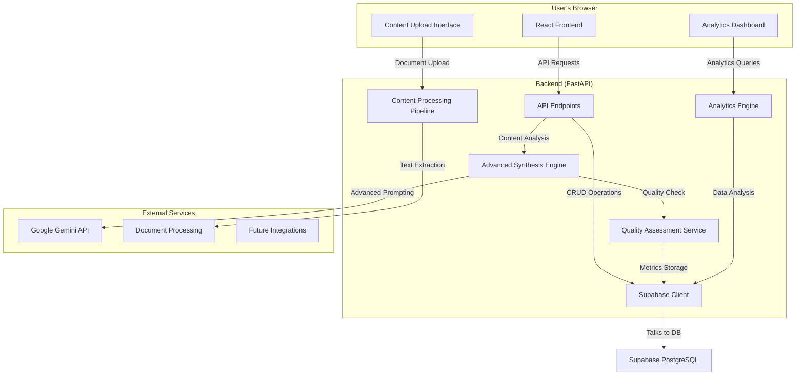

Pathfinder: Enhanced System Prompt Intelligence & Polished Experience
This document outlines the next iteration of Pathfinder, evolving from a basic MVP to a sophisticated personal AI companion that builds comprehensive, improving system prompts about a person's life areas through intelligent content synthesis and a polished user experience.

## 1. Elevator Pitch
Pathfinder is an intelligent personal reflection companion that builds deep, evolving understanding of your life areas through sophisticated AI synthesis. It transforms scattered thoughts, documents, and conversations into powerful system prompts that make every AI interaction deeply personal and contextually aware. Unlike static profiles, Pathfinder continuously learns and refines its understanding of you, creating an AI that truly knows who you are.

## 2. The Core Problem
Standard LLM interactions are generic and forgettable. Even basic personalization attempts fail because they rely on static profiles or simple Q&A. People's lives are complex, multifaceted, and constantly evolving. What's needed is an intelligent system that can synthesize diverse content sources—conversations, documents, reflections—into coherent, comprehensive understanding that grows smarter over time.

## 3. The Vision & Solution
The solution is an intelligent synthesis platform that transforms any content about your life into sophisticated system prompts. It combines advanced prompt engineering, multi-source content analysis, and continuous learning to create AI interactions that feel like talking to someone who truly understands your context, goals, and personality.

**Core Intelligence**: Advanced multi-stage synthesis engine that analyzes content for themes, extracts persona traits, and engineers coherent system prompts using sophisticated AI techniques.

**Content Diversity**: Integrate reflections, documents, chat history, structured profiles, and external data sources to build comprehensive life understanding.

**Continuous Learning**: Track prompt effectiveness, identify gaps, and automatically suggest improvements to create ever-more-accurate personal AI companions.

**Polished Experience**: Modern, intuitive interface with smart suggestions, visual progress tracking, and educational guidance for building effective prompts.

## 4. Feature Scope: Enhanced 4-Phase Evolution

### Phase 1: Intelligent Synthesis Foundation
**Backend (FastAPI):**
- Multi-stage synthesis engine with content analysis, persona extraction, and prompt engineering
- Prompt versioning system with quality assessment and improvement suggestions
- Content source management with weighting and relationship mapping
- Advanced LLM integration with sophisticated prompting techniques

**Frontend (React):**
- Enhanced realm dashboard with visual quality metrics and content overview
- Intelligent onboarding flow with guided setup and content import wizard
- Prompt evolution timeline with diff visualization and version comparison
- Smart suggestions for improving realm completeness and quality

### Phase 2: Content Diversification & Analytics
**Backend (FastAPI):**
- Document upload and processing (PDF, Word, text files)
- Chat history mining for automatic insight extraction
- Structured profile builders for comprehensive life area coverage
- Prompt effectiveness tracking with conversation quality metrics

**Frontend (React):**
- Content source management interface with drag-drop uploads
- Advanced analytics dashboard showing prompt usage and effectiveness
- Real-time conversation context awareness and improvement suggestions
- Cross-realm intelligence visualization and pattern recognition

### Phase 3: Advanced Intelligence & Optimization
**Backend (FastAPI):**
- Automated prompt optimization with A/B testing capabilities
- Missing context detection and smart question generation
- Cross-realm learning and pattern application
- Advanced quality assessment using multiple AI models

**Frontend (React):**
- Intelligent content suggestions based on usage patterns
- Automated improvement workflows with user approval gates
- Advanced visualization of prompt effectiveness and evolution
- Collaborative features for sharing and discussing prompts

### Phase 4: Integration & Scale
**Backend (FastAPI):**
- External integrations (calendar, productivity tools, social media)
- Enterprise features with team collaboration and analytics
- Advanced privacy controls and data portability
- Mobile API optimization for progressive web app

**Frontend (React):**
- Progressive web app with offline capabilities
- Mobile-optimized interface with gesture controls
- Team collaboration features with shared realms and insights
- Advanced customization options for power users

## 5. Tech Stack
**Frontend Framework:** React (with Vite) + TypeScript
**Styling:** Tailwind CSS + HeadlessUI for polished components
**State Management:** Zustand for complex application state
**Visualization:** D3.js for analytics and relationship mapping
**Database:** Supabase (PostgreSQL) with advanced indexing
**Backend Framework:** Python with FastAPI + Pydantic v2
**LLM Provider:** Google Gemini API with advanced prompting
**Document Processing:** PyPDF2, python-docx, text extraction libraries
**Analytics:** Custom metrics with PostgreSQL analytics functions
**Deployment:** Vercel (frontend) + Railway/Fly.io (backend)

## 6. High-Level Architecture Flow


## 7. Enhanced Database Schema (Supabase/Postgres)

### Core Tables (Existing + Enhanced)
```sql
-- Enhanced realms with quality tracking
realms (
  id uuid PRIMARY KEY,
  name text NOT NULL,
  system_prompt text,
  current_version integer DEFAULT 1,
  quality_score float,
  last_synthesis_at timestamptz,
  created_at timestamptz DEFAULT now()
);

-- Prompt versioning and evolution tracking
prompt_versions (
  id uuid PRIMARY KEY,
  realm_id uuid REFERENCES realms(id),
  version_number integer NOT NULL,
  content text NOT NULL,
  synthesis_method text, -- 'qa_synthesis', 'text_integration', 'hybrid'
  quality_score float,
  effectiveness_metrics jsonb,
  improvement_suggestions jsonb,
  created_at timestamptz DEFAULT now()
);

-- Diverse content sources for synthesis
content_sources (
  id uuid PRIMARY KEY,
  realm_id uuid REFERENCES realms(id),
  source_type text NOT NULL, -- 'reflection', 'text', 'conversation', 'document', 'structured'
  title text,
  content text NOT NULL,
  metadata jsonb, -- file info, processing details, etc.
  weight float DEFAULT 1.0,
  last_used_at timestamptz,
  created_at timestamptz DEFAULT now()
);

-- Advanced synthesis job tracking
synthesis_jobs (
  id uuid PRIMARY KEY,
  realm_id uuid REFERENCES realms(id),
  status text NOT NULL, -- 'pending', 'processing', 'completed', 'failed'
  synthesis_type text, -- 'full', 'incremental', 'quality_improvement'
  input_sources jsonb, -- array of content source IDs
  configuration jsonb, -- synthesis parameters and options
  result_prompt text,
  quality_analysis jsonb,
  processing_time_ms integer,
  created_at timestamptz DEFAULT now()
);

-- Conversation effectiveness tracking
conversation_metrics (
  id uuid PRIMARY KEY,
  chat_id uuid REFERENCES chats(id),
  realm_id uuid REFERENCES realms(id),
  prompt_version integer,
  user_satisfaction_score integer, -- 1-5 rating
  response_relevance_score float, -- AI-assessed relevance
  context_usage_analysis jsonb, -- which prompt aspects were triggered
  improvement_suggestions jsonb,
  created_at timestamptz DEFAULT now()
);

-- Enhanced reflections with categorization
reflections (
  id uuid PRIMARY KEY,
  realm_id uuid REFERENCES realms(id),
  question text NOT NULL,
  answer text,
  category text, -- 'values', 'goals', 'personality', 'experience', etc.
  importance_score float DEFAULT 1.0,
  last_synthesized_at timestamptz,
  created_at timestamptz DEFAULT now()
);

-- Texts enhanced with processing metadata
texts (
  id uuid PRIMARY KEY,
  title text NOT NULL,
  content text NOT NULL,
  source_file_name text,
  processing_metadata jsonb,
  synthesis_history jsonb, -- track which realms this has been synthesized into
  created_at timestamptz DEFAULT now()
);
```

## 8. Enhanced API Endpoints

### Intelligent Synthesis
- `POST /realms/{realm_id}/synthesize/advanced` - Advanced multi-stage synthesis
- `POST /realms/{realm_id}/analyze-content` - Analyze all content sources for themes
- `POST /realms/{realm_id}/assess-quality` - Evaluate current prompt quality
- `GET /realms/{realm_id}/suggestions` - Get AI-generated improvement suggestions
- `POST /realms/{realm_id}/optimize` - Run automated optimization process

### Content Source Management
- `POST /content-sources` - Add new content source (any type)
- `PUT /content-sources/{source_id}/weight` - Adjust content importance
- `POST /content-sources/bulk-upload` - Upload multiple documents
- `GET /realms/{realm_id}/content-map` - Get content relationship visualization
- `POST /content-sources/extract-insights` - Extract insights from documents

### Advanced Analytics
- `GET /realms/{realm_id}/analytics` - Comprehensive realm analytics
- `GET /conversations/{chat_id}/effectiveness` - Conversation quality metrics
- `GET /prompts/effectiveness-comparison` - Compare prompt versions
- `POST /analytics/usage-patterns` - Analyze usage patterns across realms

### Quality & Optimization
- `POST /prompts/quality-assessment` - Assess prompt quality using AI
- `GET /realms/{realm_id}/completeness-score` - Calculate how complete a realm is
- `POST /realms/{realm_id}/gap-analysis` - Identify missing context areas
- `GET /optimization/suggestions` - Get personalized optimization suggestions

### Document Processing
- `POST /documents/upload` - Upload and process documents
- `POST /documents/{doc_id}/extract-for-realm` - Extract relevant content for specific realm
- `GET /documents/{doc_id}/insights` - Get AI-generated insights from document

## 9. Success Metrics & KPIs

### Quality Improvements
- **Prompt Coherence Score**: 80%+ coherence via LLM evaluation
- **User Satisfaction**: 4.5+ stars average conversation rating
- **Content Completeness**: 90%+ coverage of identified life area aspects
- **Synthesis Quality**: 85%+ improvement in prompt effectiveness over baseline

### User Experience
- **Time to First Quality Prompt**: <10 minutes from signup
- **Daily Active Usage**: 70%+ of users active within 7 days
- **Content Addition Rate**: 3+ new content sources per user per week
- **Feature Adoption**: 80%+ users using advanced synthesis features

### Technical Excellence
- **Response Time**: <500ms API responses, <3s synthesis completion
- **System Reliability**: 99.9% uptime with graceful error handling
- **Data Privacy**: Zero data breaches, full user data control
- **Processing Speed**: <30s for comprehensive document processing